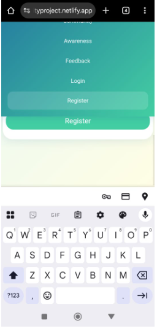

# Bug Report
### Group Name: BUG BUNNISHERS
### PROJECT TITLE: CLEANCITY
### TEAM : 3 MEMBERS

## Overview
This document lists defects identified during manual functional testing of the Clean City web application.
--

| ID    | Area      | Description                             | Severity | Status        | Detected By |
| ----- | --------- | --------------------------------------- | -------- | ------------- | ----------- |
| D-001 | Blog      | Comment button not responsive on mobile | Medium   | Open          | QA          |
| D-002 | Community | Like count not updating in real time    | Low      | Investigating | QA          |
| D-003 | Awareness | Eco tips rotation stops after 20s idle  | Medium   | Open          | Dev         |

| **Defect ID** | **Summary**                                   | **Module**        | **Severity** | **Status** | **Description / Steps to Reproduce**                                                                |
| ------------- | --------------------------------------------- | ----------------- | ------------ | ---------- | --------------------------------------------------------------------------------------------------- |
| BUG-001       | Missing validation for “Date” field           | Waste Management  | Major        | Open       | Steps: Leave Date blank → Submit form → No error shown. Expected: Validation error “Date required.” |
| BUG-002       | Missing alt-text on Awareness infographics    | Awareness Section | Medium       | Open       | Steps: Use screen reader → Alt text missing on images.                                              |
| BUG-003       | Community posts not sorted chronologically    | Community Feed    | Minor        | Open       | Steps: Create new post → Appears below older ones.                                                  |
| BUG-004       | “Mark as Scheduled” button doesn’t refresh UI | Admin Panel       | Major        | Open       | Steps: Click Mark as Scheduled → Status changes, but UI doesn’t update.                             |

| Defect ID | Module | Description | Severity | Steps to Reproduce | Expected Result | Actual Result | Status |
|------------|---------|--------------|-----------|---------------------|------------------|----------------|---------|
| D001 | Events | Event filtering not implemented | Medium | Navigate to Events page, attempt to filter | Filter results by category | Filter buttons inactive | Open |
| D002 | Responsive Layout | Layout misaligns on smaller mobile screens | Medium | Open site on mobile (360px width) | Content should stack neatly | Cards overlap slightly | Open |
| D003 | Profile | User profile editing not functional | Medium | Attempt to edit profile info | Updated data saved | Edit button unresponsive | Open |
| D004 | Admin Dashboard | Occasional slow load on reports tab | Low | Open dashboard after login | Loads within 3s | Takes 5–6s sometimes | Open |
| D005 | Report Form | No confirmation modal after submission | Low | Submit report | Display success modal | Redirects silently | Open |
| D006 | Accessibility | Missing alt text for some images | Low | Inspect using DevTools | All images should have alt | Missing on few | Open |
| D007 | Login | Error messages overlap on invalid login | Low | Enter invalid password | Error message displays clearly | Text overlaps button | Fixed |
| D008 | Event Registration | Form does not validate empty fields | Medium | Click Join Event with empty fields | Should prompt user | Submits blank form | Open |

---

### Summary
- **Total defects:** 8  
- **Fixed:** 1  
- **Open:** 7  
- **Severity breakdown:** 3 Medium, 4 Low, 1 Fixed  
- Recommended improvements: Implement missing modules, improve UI responsiveness, add accessibility review.

https://mibeichebet13.atlassian.net/browse/CQT-42