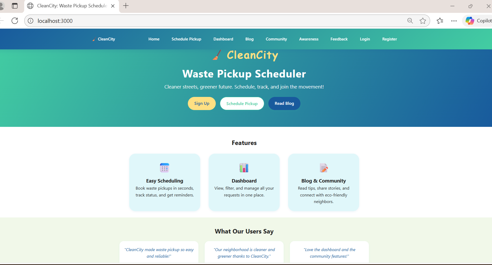
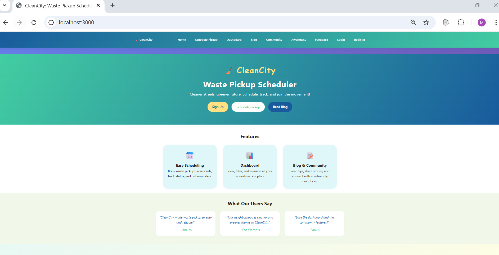

**Course:** Software Testing & Quality Assurance  
**Module:** Week 6  
**Project Type:** Group Project, Phase 1
**Submission Date:** 2025-11-05

## Test Plan

### Objectives

- We need to verify all functional requirements (submit requests, view requests, filter, update status). Validate form inputs and error messages. Confirm data persistence. Check accessibility Ensure UI responds on different screen sizes (mobile, tablet, desktop). Execute automated test suite.Detect & log issues early.

### Scope

**In Scope:**
- Home Page: pickup request form and validation
- User Registration & Login
- Dashboard: listing, filtering, and status display
- Feedback page submission, and request ID validation 
- Awareness page: content and accessibility checks
- Admin panel: update statuses, UI state,and persistence via localStorage
- Responsive layout on desktop and mobile viewports
- Automated unit/integration tests with React Testing Library

**Out of Scope:**
- Backend API tests & Database Integration
- Advanced Security penetration testing
- Performance load testing 

### Tools & Resources

- VS Code, Git, GitHub, Chrome, Jira, Jest 
- Test Manager, Risk Analyst, Test Executor

### Environments
- Development: localhost:3000 
- Browsers: Chrome, Firefox, Edge, and Safari to ensure desktop and mobile simulation
- Node.js

### Entry & Exit Criteria
**Entry Criteria:**
- Application starts successfully.
- Test data seeded/sample requests present(REQ001–REQ005).
- Test environment available.
- Test plan approved.

**Exit Criteria:**
- All priority test cases executed and passed 
- All defects fixed and re-tested.
- Test summary report completed and signed off by Test Manager.

### Schedule

| Phase | Planned Duration | Actual Duration | Status |
|-------|------------------|-----------------|--------|
| Planning| 2 days| 2 days| Test Plan & Risk Matrix|
| Risk Analysis| 2 days| 2 days| Test Cases & Scripts|
| Execution| 2 days| 1 day | Test Results & Defect|

### Test Environment setup

